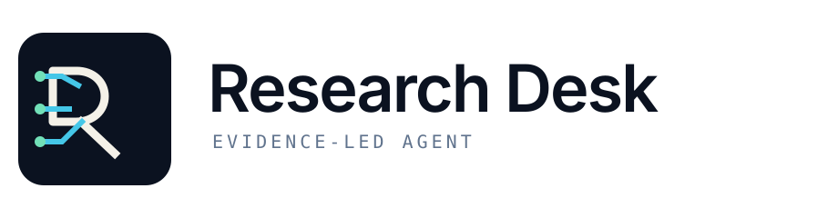
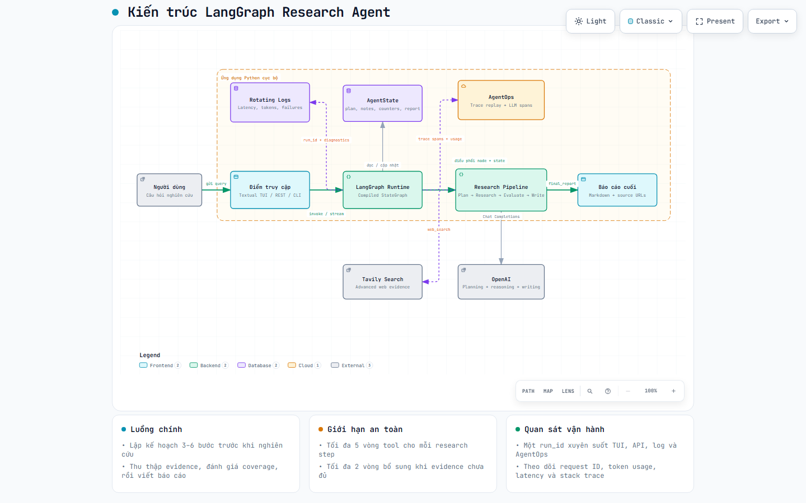

<div align="center">
  <picture>
    <source media="(prefers-color-scheme: dark)" srcset="./brand/assets/logo-dark.svg">
    <source media="(prefers-color-scheme: light)" srcset="./brand/assets/logo-light.svg">
    
  </picture>

  <p><strong>Research with a visible method.</strong></p>
  <p>A bounded, observable research agent that turns a question into a sourced report.</p>

  <p>
    
    
    
  </p>

  <p>
    <a href="#quick-start">Quick start</a> ·
    <a href="#how-it-works">How it works</a> ·
    <a href="#interfaces">Interfaces</a> ·
    <a href="./architecture.html">Architecture viewer</a>
  </p>
</div>

---

Research Desk is an open-source LangGraph reference implementation for evidence-led research. It creates a plan, runs a bounded ReAct loop against web search, evaluates the collected evidence, fills material gaps, and writes a Markdown report from the evidence it actually found.

The method stays inspectable: every run carries one correlation ID through graph state, local logs, API responses, and optional AgentOps traces.

## Why Research Desk

| Capability | What it provides |
|---|---|
| **Visible planning** | Breaks each request into 3-6 concrete research steps before searching. |
| **Bounded ReAct** | Repeats Reason → Act → Observe with a five-action ceiling per step. |
| **Evidence capture** | Preserves useful source URLs from Tavily observations. |
| **Quality loop** | Evaluates coverage and can schedule up to two follow-up passes. |
| **Grounded writing** | Instructs the writer to use only collected evidence and expose uncertainty. |
| **Run observability** | Records node timing, tool activity, model metadata, token usage, and failures. |
| **Three interfaces** | Ships with a branded Textual TUI, FastAPI endpoint, and CLI example. |

## Quick Start

### 1. Install

Requirements: Python 3.12+, [`uv`](https://docs.astral.sh/uv/), an OpenAI API key, and a Tavily API key.

```powershell
git clone https://github.com/Reriiii/langgraph-research-agent.git
Set-Location langgraph-research-agent
uv sync --frozen
Copy-Item .env.example .env
```

### 2. Configure

```dotenv
MODEL=gpt-5-mini
OPENAI_API_KEY=your-openai-api-key
TAVILY_API_KEY=your-tavily-api-key
AGENTOPS_API_KEY=your-agentops-api-key
LOG_LEVEL=INFO
```

`AGENTOPS_API_KEY` is optional. The agent continues to log locally when remote tracing is disabled.

### 3. Run the desk

```powershell
uv run python tui.py
```

Enter a focused research brief, then press `Enter` or select **Start run**.

```text
Compare the current approaches to agent memory. Prefer primary sources,
separate established findings from open questions, and include source URLs.
```

## How It Works

```text
Question
   │
   ▼
Planner ──► ReAct Research Loop ──► Evaluator ──► Writer ──► Sourced report
               │      ▲                 │
               │      │                 └── insufficient ──► follow-up plan
               ▼      │
          Tavily action
               │
               └── ToolMessage observation
```

1. **Plan**: `planner` converts the question into three to six ordered research steps.
2. **Reason**: `react_agent` privately determines what evidence the current step still needs.
3. **Act**: the model calls `web_search`; the `act` node executes the Tavily request.
4. **Observe**: results return as `ToolMessage` observations for the next ReAct iteration.
5. **Record**: `save_research` stores the evidence note and advances the plan.
6. **Evaluate**: `evaluator` checks coverage and requests follow-up research when needed.
7. **Write**: `writer` produces the final report from collected evidence only.

The agent never returns private chain-of-thought. It exposes conclusions, evidence, sources, state transitions, and operational metadata instead.

<p align="center">
  <a href="./architecture.html">
    
  </a>
</p>

<p align="center">
  <a href="./architecture.html">Explore the interactive architecture</a> ·
  <a href="./architecture.json">Inspect the source specification</a>
</p>

## Interfaces

### Terminal UI

```powershell
uv run python tui.py
```

The TUI separates the run ledger from the report canvas and streams graph updates as each node completes.

| Shortcut | Action |
|---|---|
| `Enter` | Start research from the question field |
| `Ctrl+F` | Focus the question field |
| `Ctrl+K` | Clear the current desk |
| `Ctrl+Q` | Exit |

### REST API

```powershell
uv run python main.py
```

| Route | Purpose |
|---|---|
| `GET /` | Redirect to Swagger UI |
| `GET /health` | Process health check |
| `POST /research` | Run the complete research graph |

```powershell
$body = @{
    query = "What are the strongest current approaches to agent evaluation?"
} | ConvertTo-Json

Invoke-RestMethod `
    -Method Post `
    -Uri "http://127.0.0.1:8000/research" `
    -ContentType "application/json" `
    -Body $body
```

```json
{
  "run_id": "a1b2c3d4e5f6",
  "final_report": "# Research report...",
  "research_complete": true,
  "evaluation": "Reason: ..."
}
```

Swagger UI is available at <http://127.0.0.1:8000/docs>.

### CLI Example

```powershell
uv run python run.py
```

The sample query is defined in `run.py`; use the TUI or API for arbitrary input.

## Configuration

| Variable | Required | Role |
|---|---:|---|
| `MODEL` | Yes | OpenAI model used by planner, ReAct agent, evaluator, and writer |
| `OPENAI_API_KEY` | Yes | OpenAI authentication |
| `TAVILY_API_KEY` | Yes | External evidence search |
| `AGENTOPS_API_KEY` | No | Remote trace capture and replay |
| `OPENAI_PROJECT` | No | Explicit OpenAI project attribution |
| `LOG_LEVEL` | No | Local log level; defaults to `INFO` |

Never commit `.env` or API credentials. The repository already excludes `.env` from Git.

## Observability

Every run receives a 12-character `run_id`. Use it to correlate the API response with graph nodes, model requests, tool calls, latency, token usage, and stack traces.

Local logs rotate at 5 MB and retain three backups:

```powershell
Get-Content .\logs\research-agent.log -Wait
```

Filter one run:

```powershell
Select-String -Path .\logs\research-agent.log -Pattern "run_id=a1b2c3d4e5f6"
```

When `AGENTOPS_API_KEY` is present, each TUI, API, or CLI run is also wrapped in a `research-agent` trace. AgentOps provides trace replay and operational visibility; it is not a substitute for a dedicated correctness or faithfulness evaluation suite.

## Guardrails

- ReAct tool use is capped at five iterations per research step.
- Follow-up research is capped at two evaluator-requested passes.
- Tool failures return structured error observations instead of terminating the graph immediately.
- Search results are treated as untrusted evidence, never as instructions.
- The writer is constrained to collected evidence and must state material uncertainty.
- Query previews and trace metadata may be logged; do not submit secrets.

## Development

The test suite mocks OpenAI, Tavily, and AgentOps, so it creates no external requests or usage costs.

```powershell
uv run python -m unittest discover -v
uv run python -m compileall -q app main.py run.py tui.py tests
git diff --check
```

## Project Map

```text
.
├── app/
│   ├── agents/          # Planner, ReAct loop, evaluator, retry, writer
│   ├── api/             # FastAPI request and response routes
│   ├── graph/           # AgentState and LangGraph topology
│   ├── tools/           # Tavily web search tool
│   ├── logging_config.py
│   ├── observability.py # AgentOps trace lifecycle
│   ├── main.py          # FastAPI application
│   └── tui.py           # Textual application
├── brand/               # Brand context, identity brief, tokens, and logo assets
├── tests/               # Graph, API, TUI, logging, and observability tests
├── architecture.html    # Interactive architecture viewer
├── architecture.json    # Architecture source specification
├── main.py              # API entrypoint
├── tui.py               # TUI entrypoint
└── run.py               # CLI example
```

## Brand Assets

The visual system is documented in [`brand/identity.md`](./brand/identity.md), with reusable tokens in [`brand/tokens.yaml`](./brand/tokens.yaml). Adaptive wordmarks and the standalone mark live in [`brand/assets/`](./brand/assets/).

---

<div align="center">
  <sub>Research Desk · evidence over assertion · visible process · bounded autonomy</sub>
</div>
